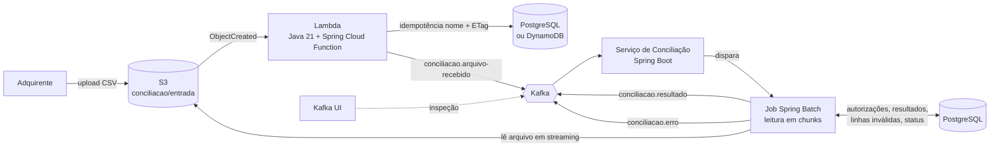
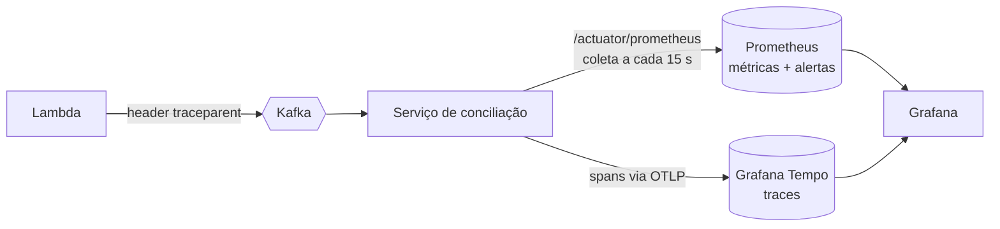

# 💳 Conciliação de Cartões — Event-Driven com Spring Batch, Kafka e AWS


Simulação do processo de **conciliação de transações de cartão** entre uma **adquirente** e um **emissor**, construída com arquitetura orientada a eventos e processamento em lote de alta volumetria.

O projeto reproduz um cenário real do mercado de meios de pagamento: todo dia a adquirente envia um arquivo com as transações capturadas, e o emissor precisa confrontar cada linha com o que foi autorizado, identificando transações conciliadas, divergentes, não encontradas e autorizações que ficaram fora do arquivo.

### ⚡ Em 30 segundos

- **Fluxo completo orientado a eventos:** S3 → Lambda (Java 21) → Kafka → Spring Batch → PostgreSQL e Kafka, rodando 100% local com Docker e LocalStack, em um único `docker compose up`.
- **Volume real:** **1 milhão de linhas em ~103 s**, com ~260 MB de memória, e o resultado conferido número a número contra um gabarito gerado junto com a massa de dados.
- **Nenhum arquivo perdido nem processado duas vezes:** idempotência em três camadas, restart do último chunk confirmado, recuperação automática depois de uma queda e retomada da leitura do S3. Cada garantia foi testada **provocando a falha** correspondente.
- **Observável de ponta a ponta:** métricas de negócio no Prometheus, dashboard provisionado no Grafana, alertas e **um único trace por arquivo**, da Lambda até cada chunk do job, com o `traceId` em todas as linhas de log.
- **67 testes automatizados:** 55 unitários e 12 de integração com Testcontainers (LocalStack, PostgreSQL e Kafka de verdade).
- **Práticas de sistemas de cartões:** o PAN nunca entra em resultados, eventos ou logs, e dinheiro é sempre `BigDecimal`.

---

## 📌 Índice

- [Contexto de negócio](#-contexto-de-negócio)
- [Arquitetura](#-arquitetura)
- [Stack](#-stack)
- [Decisões técnicas](#-decisões-técnicas)
- [Estrutura do repositório](#-estrutura-do-repositório)
- [Como executar](#-como-executar)
- [Operação](#-operação)
- [Observabilidade](#-observabilidade)
- [Eventos Kafka](#-eventos-kafka)
- [Garantias de processamento](#-garantias-de-processamento)
- [Testes](#-testes)
- [Desempenho](#-desempenho)
- [Formato do arquivo de conciliação](#-formato-do-arquivo-de-conciliação)
- [Segurança e PCI-DSS](#-segurança-e-pci-dss)
- [Solução de problemas](#-solução-de-problemas)
- [Roadmap](#-roadmap)
- [Autor](#-autor)
- [Licença](#-licença)

---

## 🏦 Contexto de negócio

No fluxo de cartões, a **autorização** acontece em tempo real, mas a confirmação financeira chega depois, em lote:

1. O portador faz uma compra e o **emissor autoriza** a transação.
2. Ao fim do dia, a **adquirente** envia o arquivo de transações capturadas (clearing).
3. O emissor **concilia** o arquivo com a sua base de autorizações.
4. Divergências (valor, data, transação inexistente) precisam ser tratadas antes da **liquidação** e do lançamento em fatura.

Este projeto implementa a etapa 3 de ponta a ponta, desde o recebimento do arquivo até a publicação do resultado de cada transação para os sistemas interessados.

---

## 🏗 Arquitetura



**Fluxo resumido**

1. A adquirente sobe o arquivo no bucket S3 `conciliacao`, prefixo `entrada/`.
2. O evento do S3 dispara uma **Lambda** leve, que valida nome, layout e duplicidade (nome + ETag) e publica um único evento `arquivo-recebido` no Kafka. Arquivos inválidos vão para `rejeitados/`.
3. O **serviço de conciliação** consome o evento e inicia um **job Spring Batch** para o arquivo.
4. O job lê o arquivo do S3 em **chunks**, sem baixá-lo inteiro, confronta cada linha com as transações autorizadas no PostgreSQL (uma consulta por chunk) e classifica o resultado.
5. Um segundo passo procura as autorizações do dia que **não vieram no arquivo**.
6. Cada resultado é gravado e publicado no Kafka; linhas inválidas são puladas e vão para um tópico de erro, sem interromper o processamento.

A Lambda atua apenas como **gatilho**: o processamento pesado fica no batch, que suporta arquivos com milhões de linhas, restart e controle transacional, sem o limite de tempo de execução de uma função serverless.

---

## 🧰 Stack

| Camada | Tecnologia |
| --- | --- |
| Linguagem | Java 21 |
| Framework | Spring Boot 4.0, Spring Batch 6, Spring Kafka 4, Spring Cloud Function |
| Mensageria | Apache Kafka 4 (modo KRaft, sem ZooKeeper) e Kafka UI |
| Cloud (emulada localmente) | AWS S3, Lambda e DynamoDB via LocalStack (AWS SDK v2) |
| Banco de dados | PostgreSQL 18, schema versionado com Flyway |
| Build | Maven multi-módulo (com Maven Wrapper) |
| Containers | Docker, Docker Compose, Dockerfile multi-stage |
| Operação | Spring Boot Actuator (health e métricas) |
| Observabilidade | Micrometer, Prometheus (métricas e alertas), Grafana, OpenTelemetry + Grafana Tempo (traces) |

---

## 🧭 Decisões técnicas

Os principais pontos de arquitetura:

- **Lambda como gatilho, não como processador:** evita o limite de 15 minutos e mantém a função simples e barata.
- **Spring Batch para alta volumetria:** processamento em chunks, restart a partir do ponto de falha via `JobRepository`, skip de linhas inválidas e tamanho de chunk configurável.
- **Uma consulta por chunk, não por linha:** o `ItemProcessor` do Spring Batch recebe um item por vez; a conciliação fica no `ItemWriter`, que recebe o lote inteiro e busca as autorizações das N linhas numa consulta só (`nsu = ANY(?)`). Em 1 milhão de linhas, são mil consultas em vez de um milhão.
- **Job assíncrono:** o consumer Kafka registra a execução e retorna; o job roda numa thread própria. Um arquivo que leva minutos não estoura o `max.poll.interval.ms` do consumer.
- **Leitura em streaming do S3:** o arquivo é lido conforme o job avança, com memória constante. Se a conexão cair no meio, a leitura retoma do byte em que parou.
- **Dinheiro com `BigDecimal`:** comparação com `compareTo`, porque o `equals` considera a escala (150.9 ≠ 150.90).
- **Kafka para desacoplamento:** múltiplos consumidores podem reagir ao resultado da conciliação (agenda de recebíveis, relatórios, antifraude) sem acoplamento ao job.
- **Idempotência na entrada:** o mesmo arquivo reenviado, ou o mesmo evento do S3 entregue duas vezes, não gera reprocessamento. A chave é nome + ETag, gravada de forma atômica: `UNIQUE` + `ON CONFLICT` no PostgreSQL ou `PutItem` condicional no DynamoDB, escolhido por `IDEMPOTENCIA_PROVEDOR` sem recompilar.
- **Linhas inválidas não param o arquivo:** cada linha fora do layout é pulada e publicada em `conciliacao.erro` com o número e o motivo, sem dados do cartão; acima de um limite configurável, o arquivo é considerado corrompido.
- **Restart do ponto de falha:** se o job cai no meio, ele continua do último chunk confirmado. Uma queda do serviço é recuperada automaticamente na subida; uma falha comum pode ser reiniciada por `POST /execucoes/{id}/reiniciar`.
- **Arquivos inválidos não se perdem:** nome ou cabeçalho fora do layout movem o arquivo para `rejeitados/`, com o motivo em metadado.
- **Cold start da Lambda em Java:** no LocalStack, a inicialização (JVM + Spring) mede de 2,0 a 2,5 s e a primeira invocação de 300 a 600 ms; com o container já quente, de 10 a 70 ms. Para reduzir: só o compilador JIT C1 (`-XX:TieredStopAtLevel=1`), cliente Kafka puro em vez do Spring Kafka e JAR enxuto, sem WebFlux/Netty nem compressão nativa. Na AWS real, a mitigação seguinte é o **SnapStart**, que restaura a JVM já inicializada a partir de um snapshot; a conexão JDBC é revalidada antes do uso, o que cobre a conexão "morta" vinda do snapshot.
- **Observabilidade como código:** regras de alerta, datasources e o dashboard do Grafana são arquivos versionados em `infra/`; o ambiente sobe pronto. Métricas de negócio só contam depois do commit do chunk, então um rollback não infla os números. O trace atravessa Lambda → Kafka → thread do job, e o nível de detalhe é o chunk (não a linha), para não gerar milhões de spans.
- **Idempotência em PostgreSQL ou DynamoDB:** os dois provedores dão o mesmo resultado e o mesmo cold start no ambiente local. O ganho do DynamoDB aparece na AWS real, onde muitas Lambdas em paralelo esgotariam as conexões do Postgres (a alternativa seria o RDS Proxy).

---

## 📁 Estrutura do repositório

```
.
├── docker-compose.yml             # LocalStack, Kafka, PostgreSQL, serviço de conciliação, Kafka UI e observabilidade
├── .env.example                   # variáveis de ambiente necessárias
├── pom.xml                        # POM pai (multi-módulo)
├── mvnw, mvnw.cmd, .mvn/          # Maven Wrapper (não precisa instalar o Maven)
├── conciliacao-eventos/           # DTOs e contratos dos eventos
├── conciliacao-teste-suporte/     # Containers compartilhados dos testes de integração (só em escopo de teste)
├── conciliacao-lambda/            # Lambda: valida o arquivo e publica no Kafka
├── conciliacao-batch/             # Consumer Kafka + job Spring Batch (com Dockerfile multi-stage)
├── gerador-dados/                 # Gera o arquivo da adquirente, as autorizações e o gabarito para testes de volume
├── infra/                         # Init (bucket, tabela DynamoDB, Lambda, tópicos), migrations, exemplos,
│                                  # Prometheus (coleta e alertas), Grafana (datasources e dashboard) e Tempo
├── scripts/                       # Deploy da Lambda, carga de massa, envio, conferência e medição
├── LICENSE                        # licença MIT
└── docs/
    └── comandos.md                # comandos do dia a dia (subir infra, deploy, inspecionar Kafka/S3/banco)
```

> A estrutura evolui conforme as fases do [roadmap](#-roadmap).

---

## 🚀 Como executar

### Pré-requisitos

- Docker e Docker Compose
- Java 21 (o Maven vem pelo wrapper `mvnw`, não precisa instalar)
- Conta gratuita no LocalStack (plano Hobby) para gerar o auth token
- Recomendado: 8 GB de RAM livres para os containers

### 1. Configurar o ambiente

```bash
cp .env.example .env
# edite o .env e informe seu LOCALSTACK_AUTH_TOKEN

# opcional: onde a Lambda guarda a idempotência (postgres é o padrão)
# IDEMPOTENCIA_PROVEDOR=dynamodb
```

### 2. Build

```bash
./mvnw clean package          # Windows: .\mvnw.cmd clean package
```

Gera, entre outros, o JAR da Lambda (`conciliacao-lambda/target/conciliacao-lambda-*-aws.jar`).

### 3. Subir o ambiente

```bash
docker compose up -d --wait   # retorna quando todos os serviços estão saudáveis
```

Ao subir, o Flyway aplica as migrations no PostgreSQL, o `kafka-init` cria os tópicos, o
LocalStack cria o bucket e a tabela do DynamoDB, publica a Lambda e liga a notificação do S3 a ela,
e o serviço de conciliação (imagem construída pelo `conciliacao-batch/Dockerfile`) passa a consumir
os eventos. Na primeira vez o build da imagem leva cerca de 2 minutos.

| Serviço | Endereço |
| --- | --- |
| Kafka UI (tópicos, mensagens, consumer groups) | http://localhost:8080 |
| Serviço de conciliação (Actuator) | http://localhost:8081/actuator/health |
| Grafana (dashboard, traces, alertas), em português | http://localhost:3000 |
| Prometheus (métricas, alertas) | http://localhost:9090 |
| Tempo (API de traces; OTLP em `4318`) | http://localhost:3200 |
| LocalStack (S3, Lambda, DynamoDB) | `localhost:4566` |
| Kafka (containers na rede Docker) | `kafka:9092` |
| Kafka (aplicações no host) | `localhost:9094` |
| PostgreSQL | `localhost:5432` |

Depois de alterar o código:

```powershell
.\scripts\deploy-lambda.ps1                          # Lambda: recompila e republica no LocalStack
docker compose up -d --build conciliacao-batch       # serviço de conciliação: reconstrói a imagem
```

### 4. Enviar um arquivo

Carregue as transações autorizadas de exemplo (uma para cada resultado possível) e envie o arquivo
da adquirente:

```bash
docker exec -i postgres psql -U conciliacao -d conciliacao < infra/exemplos/transacoes_autorizadas_20261001.sql
docker exec localstack awslocal s3 cp /exemplos/conciliacao_20261001.csv s3://conciliacao/entrada/
```

`/exemplos` é a pasta `infra/exemplos` montada no LocalStack; `awslocal` é a AWS CLI já
apontada para o LocalStack. Para um teste com 1 milhão de linhas, veja [Desempenho](#-desempenho).

### 5. Acompanhar o resultado

```bash
docker logs -f conciliacao-batch
```

```
Job finalizado: execução 1 do arquivo conciliacao_20261001.csv com status COMPLETED (5 lidas, 5 gravadas, 752 ms)
Resumo do arquivo conciliacao_20261001.csv: {AUSENTE_NO_ARQUIVO=1, CONCILIADA=1, DIVERGENTE=2, NAO_ENCONTRADA=1}
```

No Kafka UI (http://localhost:8080), os resultados ficam em `conciliacao.resultado` e as linhas
inválidas em `conciliacao.erro`. No banco:

```bash
docker exec postgres psql -U conciliacao -d conciliacao -c "select nome_arquivo, status, linhas_processadas, linhas_invalidas from arquivo_recebido order by recebido_em desc limit 5"
docker exec postgres psql -U conciliacao -d conciliacao -c "select numero_linha, nsu, status, campos_divergentes from resultado_conciliacao order by id desc limit 10"
```

Todos os cenários de validação (duplicidade, linhas inválidas, Kafka fora do ar, queda do serviço
e restart) estão em [`docs/comandos.md`](docs/comandos.md).

---

## 🛠 Operação

**Endpoints do serviço de conciliação** (porta 8081):

| Endpoint | Para quê |
| --- | --- |
| `GET /actuator/health` | Saúde do serviço e da conexão com o banco (usado pelo healthcheck do container) |
| `GET /actuator/metrics/spring.batch.job` | Métricas dos jobs executados |
| `GET /actuator/prometheus` | Todas as métricas no formato do Prometheus (coletadas a cada 15 s) |
| `POST /execucoes/{id}/reiniciar` | Reinicia uma execução que falhou, do último chunk confirmado (`202` com o id da nova execução) |

**Acompanhamento de um arquivo**, na tabela `arquivo_recebido`: `RECEBIDO` (Lambda) → `PROCESSANDO`
→ `CONCLUIDO` ou `FALHA`, com linhas processadas, linhas inválidas e a mensagem de erro. As linhas
inválidas ficam em `linha_invalida` (número e motivo); o progresso de cada job, nas tabelas do
Spring Batch (`batch_job_execution`, `batch_step_execution`).

**Variáveis do serviço de conciliação:**

| Variável | Padrão | Efeito |
| --- | --- | --- |
| `JOB_TAMANHO_CHUNK` | 1000 | Linhas por transação (ver [Desempenho](#-desempenho)) |
| `JOB_EXECUCOES_SIMULTANEAS` | 2 | Arquivos processados ao mesmo tempo |
| `JOB_PERCENTUAL_MAXIMO_LINHAS_INVALIDAS` | 1 | Acima deste % das linhas lidas, o arquivo é considerado corrompido |
| `JOB_MINIMO_LINHAS_INVALIDAS` | 100 | Tolerância mínima, para arquivos pequenos |

**Scripts** (PowerShell, em `scripts/`):

| Script | Para quê |
| --- | --- |
| `deploy-lambda.ps1` | Recompila e republica a Lambda no LocalStack |
| `carregar-autorizacoes.ps1` | Carga em massa das autorizações geradas (`COPY`), repetível |
| `enviar-arquivo.ps1` | Envia um arquivo grande para `s3://conciliacao/entrada/` |
| `conferir-gabarito.ps1` | Compara o resultado do job com o gabarito do gerador; sai com código 1 se algo não bater |
| `medir-desempenho.ps1` | Processa o arquivo com um tamanho de chunk e mede duração, memória e CPU |
| `liberar-reenvio.ps1` | Só para testes: permite reprocessar um arquivo já recebido |
| `limpar-ambiente.ps1` | Só para desenvolvimento: zera banco, DynamoDB, bucket e tópicos (`-Executar`; sem ele, só mostra o que faria) |

---

## 📊 Observabilidade

Os três sinais têm papéis diferentes: **métricas** mostram *quanto* e *quão rápido*, **traces**
mostram *por onde* um arquivo passou e *onde* o tempo foi gasto, e os **logs** dão o detalhe, ligados
ao trace pelo `traceId`.



### Métricas e dashboard

O Grafana sobe com o datasource e o dashboard **Conciliação de cartões** já provisionados
(`infra/grafana`), em três faixas:

| Faixa | Painéis |
| --- | --- |
| Negócio | Arquivos concluídos e com falha, jobs em execução, arquivos na fila, linhas inválidas, taxa de conciliação, resultados por segundo e por status |
| Spring Batch e Kafka | Duração do job e dos steps, tempo médio de escrita por chunk, lag do consumer por partição |
| Recursos | Heap da JVM × máximo, CPU e pausas de GC, conexões do pool (ativas, ociosas, pendentes) |

Métricas de negócio criadas no serviço (além das que já vêm do Spring Boot, do Spring Batch e do cliente Kafka):

| Métrica | Rótulos | Significado |
| --- | --- | --- |
| `conciliacao_resultados_total` | `status` | Transações conciliadas, por resultado |
| `conciliacao_linhas_invalidas_total` | | Linhas puladas por estarem fora do layout ou das regras |
| `conciliacao_arquivos_total` | `status` (`CONCLUIDO`, `FALHA`) | Arquivos processados, por status final |

Elas só são incrementadas **depois do commit do chunk**: se o chunk é desfeito e reprocessado, nada é contado duas vezes.

### Traces

Cada arquivo gera **um trace**, da Lambda ao último chunk:

```
conciliacao.arquivo-recebido process     consumer Kafka (continua o traceparent enviado pela Lambda)
└─ spring.batch.job.launch.count         lançamento do job
   └─ spring.batch.job                   o job, já na thread própria
      ├─ spring.batch.step               conciliarLinhas
      │  └─ spring.batch.chunk.write     um por chunk: consulta, gravação e publicação
      └─ spring.batch.step               registrarAusentes
         └─ spring.batch.chunk.write
```

Para achar o trace de um arquivo, copie o `traceId` do log (da Lambda, `Publicado: ... traceId=...`,
ou do serviço, `[traceId-spanId]` em cada linha) e cole no Grafana em **Explorar → Tempo**.

- A Lambda **não usa o SDK do OpenTelemetry** (JAR e cold start preservados): ela só gera o
  `traceparent` W3C e o envia no header do evento. Por isso o Tempo mostra a raiz do trace como
  "faltando"; o `traceId` no log da Lambda liga as duas pontas.
- O detalhe vai até o **chunk**: um arquivo de 1 milhão de linhas gera cerca de mil spans. Spans por
  linha (leitura e processamento de cada item) estão desligados; seriam 2 milhões.
- Requisições ao `/actuator` (coleta do Prometheus e healthcheck) não geram traces.
- Amostragem de 100%: o volume é de um trace por arquivo.

### Alertas

Regras em `infra/prometheus/alertas.yml`, visíveis em http://localhost:9090/alerts e no Grafana
(**Alertas → Regras de alerta**):

| Alerta | Severidade | Dispara quando |
| --- | --- | --- |
| `ArquivoComFalha` | crítica | Algum arquivo terminou em `FALHA` nos últimos 10 min |
| `ServicoBatchFora` | crítica | O Prometheus não consegue coletar o serviço há 1 min |
| `LinhasInvalidasAcimaDoNormal` | aviso | Mais de 0,8% de linhas inválidas em 15 min (antes do limite de 1% que derruba o arquivo) |
| `ArquivosParadosNaFila` | aviso | Arquivos esperando thread livre há 10 min |
| `ConsumerKafkaAtrasado` | aviso | Eventos de arquivo sem consumo há 5 min |
| `MemoriaHeapAlta` | aviso | Heap acima de 90% por 5 min |
| `PoolDeConexoesEsgotado` | aviso | Threads esperando conexão com o banco há 2 min |

Neste ambiente não há Alertmanager: os alertas aparecem, mas não são enviados (e-mail, Slack etc.).
`ArquivoComFalha` e `ServicoBatchFora` foram testados provocando a falha (arquivo com linhas
inválidas acima do limite e serviço parado).

**Custo:** com métricas e tracing ligados, o teste de 1 milhão de linhas levou 99 s, contra 103 s
antes da observabilidade: dentro da variação entre rodadas. Prometheus, Grafana e Tempo somam
cerca de 250 MB de memória.

---

## 📨 Eventos Kafka

| Tópico | Produtor | Conteúdo |
| --- | --- | --- |
| `conciliacao.arquivo-recebido` | Lambda | Id do arquivo, bucket, chave, ETag, tamanho, data de referência e de recebimento. Chave: id do arquivo |
| `conciliacao.resultado` | Job Spring Batch | Resultado por transação: `CONCILIADA`, `DIVERGENTE` (com os campos divergentes), `NAO_ENCONTRADA` ou `AUSENTE_NO_ARQUIVO` (autorização sem linha no arquivo), sem PAN. Chave: NSU |
| `conciliacao.erro` | Job Spring Batch | Linhas inválidas, com número da linha e motivo (nunca o conteúdo). Chave: id do arquivo |

Os eventos de resultado usam o **NSU** como chave: o milhão de resultados de um arquivo grande se espalha pelas partições, e os consumidores escalam com elas (com o id do arquivo como chave, tudo caía numa partição só). A entrega é *pelo menos uma vez*; consumidores usam `idArquivo + nsu + codigoAutorizacao` para descartar repetições.

---

## 🛡 Garantias de processamento

Um arquivo de conciliação não pode ser perdido nem processado duas vezes. Cada ponto em que isso
poderia acontecer tem uma proteção, e cada uma foi testada provocando a falha correspondente:

| Situação | O que acontece |
| --- | --- |
| A adquirente reenvia o mesmo arquivo, ou o S3 entrega o mesmo evento duas vezes | A Lambda reconhece nome + ETag já registrados e não publica nada |
| O mesmo nome chega com conteúdo diferente (correção) | ETag diferente: é tratado como arquivo novo |
| O Kafka está fora do ar quando a Lambda publica | O registro de idempotência é desfeito e a retentativa automática da Lambda publica depois |
| O evento do Kafka chega duas vezes ao serviço | Um arquivo é uma única execução de job (`JobInstance` por id); a segunda é recusada |
| Linhas fora do layout | São puladas, registradas e publicadas em `conciliacao.erro`; o resto do arquivo segue |
| O Kafka cai no meio do job | O chunk em andamento é desfeito por inteiro (nada fica gravado sem ter sido publicado); a execução fica `FALHA` e pode ser reiniciada |
| O serviço morre no meio do job | Na subida, a execução interrompida é recuperada e continua do último chunk confirmado, antes de o consumer voltar a ler eventos |
| A conexão com o S3 cai no meio da leitura | A leitura retoma do byte em que parou, com `If-Match` do ETag para nunca emendar duas versões do arquivo |

Num restart, um mesmo resultado pode ser publicado de novo: a entrega no Kafka é *pelo menos uma
vez*. No banco não há duplicidade: chaves únicas por arquivo e linha impedem a gravação dupla.

Premissa: **uma instância** do serviço de conciliação. Com várias, a recuperação na subida precisaria
de um controle de posse das execuções (lease/heartbeat) para não "recuperar" o job de outra instância viva.

---

## 🧪 Testes

```bash
./mvnw package     # 55 testes unitários, sem Docker (~15 s, sem o clean)
./mvnw verify      # + 12 testes de integração com containers de verdade (~90 s com o clean)
```

**Unitários** (`*Test.java`): regras de conciliação (incluindo `BigDecimal` com escalas diferentes e a
chave NSU + código), validação do layout do arquivo, limite percentual de linhas inválidas, retomada
da leitura do S3 depois de uma queda de conexão (sem perder nem repetir bytes), seleção do provedor de
idempotência, gerador de massa (gabarito e reprodutibilidade), a garantia de que nenhuma mensagem de
erro carrega o conteúdo da linha, métricas que só contam após o commit (rollback não conta) e o
formato W3C do `traceparent`.

**Integração** (`*IT.java`), com [Testcontainers](https://testcontainers.com) e as **mesmas imagens do
docker-compose** (LocalStack, PostgreSQL 18 e Kafka 4); o PostgreSQL recebe as migrations reais de
`infra/postgres/migrations`:

| Teste | Containers | O que prova |
| --- | --- | --- |
| `ConciliacaoJobIT` | LocalStack (S3), PostgreSQL, Kafka | Evento no Kafka → job → os quatro status no banco e no tópico (chave NSU, sem PAN); evento repetido não reprocessa; linhas inválidas vão para `linha_invalida` e `conciliacao.erro` |
| `ReceberArquivoFunctionIT` | LocalStack (S3), PostgreSQL, Kafka | A Lambda publica um evento por arquivo, mesmo com a notificação entregue duas vezes; nome ou cabeçalho inválidos movem o arquivo para `rejeitados/` com o motivo |
| `RegistroIdempotenciaPostgresIT` | PostgreSQL | `ON CONFLICT` detecta o duplicado; mesmo nome com outro conteúdo é arquivo novo; desfazer permite a retentativa |
| `RegistroIdempotenciaDynamoIT` | LocalStack (DynamoDB) | `PutItem` condicional detecta o duplicado; a remoção não apaga o registro de outra execução |

Cada container sobe uma vez e é reaproveitado por todos os testes do módulo; ao fim, o
Testcontainers remove tudo. Requisitos: Docker em execução e o `LOCALSTACK_AUTH_TOKEN` (lido da
variável de ambiente ou, se ela não existir, do `.env`). Sem token, os testes que usam o LocalStack são
**pulados** com o motivo, em vez de falhar.

---

## 📈 Desempenho

Teste com **1 milhão de linhas** gerado pelo `gerador-dados`, passando pelo fluxo completo
(S3 → Lambda → Kafka → Spring Batch → PostgreSQL e Kafka), tudo local em Docker. O serviço de
conciliação roda em container limitado a 768 MB. Para cada linha, o job consulta a autorização
(uma consulta por chunk), grava o resultado e publica uma mensagem no Kafka.

| Chunk | Duração do job | Linhas/s | Memória máx. |
| --- | --- | --- | --- |
| 1.000 (padrão) | 103 s | ~9.700 | 260 MB |
| 5.000 | 91 s | ~11.000 | 315 MB |

Em todas as rodadas o resultado conferiu com o gabarito do gerador: 924.889 conciliadas,
39.857 divergentes, 30.294 não encontradas, 25.000 ausentes no arquivo e 4.960 linhas inválidas.
O chunk é ajustável por `JOB_TAMANHO_CHUNK`.

**O que o teste de volume revelou e mudou no código:**

- **Conexões longas com o S3 caem:** a leitura de um arquivo grande leva mais de um minuto, e a
  conexão era derrubada no meio. Agora a leitura retoma do byte em que parou (`Range` + `If-Match`
  do ETag), sem perder nem repetir linhas.
- **Chave das mensagens:** com o id do arquivo como chave, o milhão de resultados caía numa única
  partição. Com o NSU, as mensagens se espalham e o job ficou ~8% mais rápido.
- **Contagem exata depois de um restart:** linhas inválidas de um chunk desfeito eram contadas duas
  vezes; agora ficam numa tabela com chave por arquivo e linha.
- **Limite de linhas inválidas percentual** (1% das linhas lidas), e não um número fixo que não escala.

> Números de um ambiente local (Windows 11, Docker Desktop com ~7,4 GB para os containers): servem
> para comparar configurações, não como capacidade de produção.

Para reproduzir: [`docs/comandos.md`](docs/comandos.md), etapa 4.

---

## 📄 Formato do arquivo de conciliação

Arquivo CSV com cabeçalho, separado por `;`, nomeado no padrão `conciliacao_AAAAMMDD.csv` (a data
do nome é a data de referência):

```csv
nsu;codigo_autorizacao;data_transacao;valor;pan_mascarado;mcc;parcelas
000123456;A1B2C3;2026-10-01T14:32:10;150.90;411111******1111;5411;1
```

| Campo | Regra |
| --- | --- |
| `nsu` + `codigo_autorizacao` | Chave da conciliação com a autorização do emissor; não podem ser vazios |
| `data_transacao` | ISO 8601 (`AAAA-MM-DDThh:mm:ss`); na conciliação basta o mesmo dia |
| `valor` | Decimal com ponto, maior que zero |
| `pan_mascarado` | Formato esperado: 6 primeiros e 4 últimos dígitos (`411111******1111`); não entra em resultados, eventos nem logs |
| `mcc` | Texto (preserva zeros à esquerda) |
| `parcelas` | Inteiro, no mínimo 1 |

Na Lambda: nome fora do padrão, arquivo vazio ou cabeçalho diferente movem o arquivo para
`rejeitados/`. No job: linha que viola alguma regra acima é pulada e registrada.

**Resultado da conciliação:** `CONCILIADA` quando valor, parcelas e dia batem; `DIVERGENTE` lista os
campos diferentes (`VALOR`, `PARCELAS`, `DATA`); `NAO_ENCONTRADA` quando não há autorização; e
`AUSENTE_NO_ARQUIVO` para a autorização do dia que a adquirente não informou.

---

## 🔒 Segurança e PCI-DSS

Mesmo sendo um ambiente de estudo, o projeto segue práticas exigidas em sistemas de cartões:

- O número do cartão (**PAN**) nunca é armazenado nem logado completo; os dados de exemplo usam PAN mascarado.
- Resultados, eventos Kafka e mensagens de erro identificam a transação por NSU + código de
  autorização, sem o PAN. O motivo de uma linha inválida nunca inclui o conteúdo da linha (a mensagem
  padrão do Spring Batch traz a linha inteira e é descartada; há teste para isso).
- Segredos ficam fora do código e do repositório (`.env` no `.gitignore` e no `.dockerignore`, fora da imagem).
- O serviço de conciliação roda no container com usuário sem privilégios.
- Valores monetários são tratados com `BigDecimal`, nunca com ponto flutuante.
- O endpoint de restart não tem autenticação: é operacional e, fora do ambiente local, ficaria
  atrás de autenticação ou de rede interna.

---

## 🧯 Solução de problemas

| Sintoma | Causa e solução |
| --- | --- |
| Maven falha com `PKIX path building failed` | Antivírus com inspeção de HTTPS (AVG, Avast etc.) reassinando os certificados. Faça o Java usar os certificados do Windows: variável de usuário `MAVEN_OPTS=-Djavax.net.ssl.trustStoreType=Windows-ROOT` e um terminal novo |
| `docker compose up` reclama de `LOCALSTACK_AUTH_TOKEN` | Falta o token no `.env` (gratuito no plano Hobby do LocalStack) |
| A Lambda não é publicada ao subir o ambiente | O JAR ainda não existia: rode `.\mvnw.cmd package` e depois `.\scripts\deploy-lambda.ps1` |
| `Unable to rename ... .jar.original` no build (Windows) | O serviço está rodando pelo `java -jar` e o Windows trava o JAR em uso: pare-o antes de compilar |
| No Git Bash, `docker exec ... /opt/kafka/...` procura `C:/Program Files/Git/opt/...` | O Git Bash converte caminhos que começam com `/`: prefixe o comando com `MSYS_NO_PATHCONV=1` (ou use o PowerShell) |
| Reenvio de um arquivo não gera job | É a idempotência funcionando (mesmo nome + ETag). Para testes: `.\scripts\liberar-reenvio.ps1 <arquivo>` |
| Log `Leitura de s3://... interrompida ...; retomando` | Normal em arquivos grandes: a conexão com o S3 caiu e a leitura continuou do mesmo byte |
| Rodar o serviço pela IDE e pelo container ao mesmo tempo | Não faça: as duas instâncias dividiriam as partições. `docker compose stop conciliacao-batch` antes |
| Dados de testes antigos atrapalhando | `.\scripts\limpar-ambiente.ps1 -Executar` |
| No Grafana não aparece a opção de editar o dashboard | O acesso sem login é só leitura: entre como `admin` / `admin`. Para versionar a mudança, exporte o JSON para `infra/grafana/dashboards/` |
| Painéis do Grafana vazios com o serviço rodando pela IDE | O Prometheus coleta `conciliacao-batch:8081` (container). Troque o alvo em `infra/prometheus/prometheus.yml` por `host.docker.internal:8081` |
| Trace no Tempo com "missing root span" | Esperado: a raiz é o span da Lambda, que só gera o `traceparent` e não exporta spans |

---

## 🗺 Roadmap

- [x] **Fase 1:** estrutura Maven multi-módulo e infraestrutura com Docker Compose
- [x] **Fase 2:** Lambda Java publicando no Kafka a partir do upload no S3
- [x] **Fase 3:** consumer Kafka e job Spring Batch de conciliação
- [x] **Fase 4:** gerador de massa de dados e teste com 1 milhão de linhas
- [x] **Fase 5:** documentação
- [x] **Fase 6:** testes automatizados com JUnit 5 e Testcontainers
- [x] **Fase 7:** observabilidade com OpenTelemetry, Prometheus, Grafana e Tempo
- [ ] **Fase 8:** pipeline CI/CD com GitHub Actions e scan de segurança (Trivy)
- [ ] **Fase 9:** deploy na AWS com Terraform

---

## 👤 Autor

**Douglas Croti**
> - Desenvolvedor de Software | - Sistemas Web Seguros | - Experiência em Fintechs e Provedores de Internet | - Engenheiro de Software 
> - Foco em Desenvolvimento Web, Segurança e Transações Financeiras

[](https://github.com/douglascroti)

---

## 📜 Licença

Distribuído sob a licença MIT. Veja [`LICENSE`](LICENSE).
