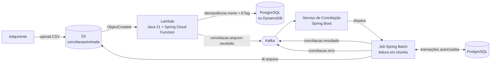

# 💳 Conciliação de Cartões — Event-Driven com Spring Batch, Kafka e AWS


Simulação do processo de **conciliação de transações de cartão** entre uma **adquirente** e um **emissor**, construída com arquitetura orientada a eventos e processamento em lote de alta volumetria.

O projeto reproduz um cenário real do mercado de meios de pagamento: todo dia a adquirente envia um arquivo com as transações capturadas, e o emissor precisa confrontar cada linha com o que foi autorizado, identificando transações conciliadas, divergentes ou não encontradas.

---

## 📌 Índice

- [Contexto de negócio](#-contexto-de-negócio)
- [Arquitetura](#-arquitetura)
- [Stack](#-stack)
- [Decisões técnicas](#-decisões-técnicas)
- [Estrutura do repositório](#-estrutura-do-repositório)
- [Como executar](#-como-executar)
- [Eventos Kafka](#-eventos-kafka)
- [Formato do arquivo de conciliação](#-formato-do-arquivo-de-conciliação)
- [Segurança e PCI-DSS](#-segurança-e-pci-dss)
- [Roadmap](#-roadmap)
- [Autor](#-autor)

---

## 🏦 Contexto de negócio

No fluxo de cartões, a **autorização** acontece em tempo real, mas a confirmação financeira chega depois, em lote:

1. O portador faz uma compra e o **emissor autoriza** a transação.
2. Ao fim do dia, a **adquirente** envia o arquivo de transações capturadas (clearing).
3. O emissor **concilia** o arquivo com a sua base de autorizações.
4. Divergências (valor, data, transação inexistente) precisam ser tratadas antes da **liquidação** e do lançamento em fatura.

Este projeto implementa a etapa 3 de ponta a ponta, desde o recebimento do arquivo até a publicação do resultado de cada transação para os sistemas interessados.

---

## 🏗 Arquitetura



**Fluxo resumido**

1. A adquirente sobe o arquivo no bucket S3 `conciliacao`, prefixo `entrada/`.
2. O evento do S3 dispara uma **Lambda** leve, que valida nome, layout e duplicidade (nome + ETag) e publica um único evento `arquivo-recebido` no Kafka.
3. O **serviço de conciliação** consome o evento e inicia um **job Spring Batch**.
4. O job lê o arquivo em **chunks**, confronta cada linha com as transações autorizadas no PostgreSQL e classifica o resultado.
5. Cada resultado é publicado no Kafka; linhas inválidas vão para um tópico de erro sem interromper o processamento.

A Lambda atua apenas como **gatilho**: o processamento pesado fica no batch, que suporta arquivos com milhões de linhas, restart e controle transacional, sem o limite de tempo de execução de uma função serverless.

---

## 🧰 Stack

| Camada | Tecnologia |
| --- | --- |
| Linguagem | Java 21 |
| Framework | Spring Boot 4, Spring Batch, Spring Kafka, Spring Cloud Function |
| Mensageria | Apache Kafka (modo KRaft, sem ZooKeeper) |
| Cloud (emulada localmente) | AWS S3, Lambda e DynamoDB via LocalStack |
| Banco de dados | PostgreSQL |
| Build | Maven multi-módulo (com Maven Wrapper) |
| Containers | Docker, Docker Compose, Dockerfiles multi-stage |

---

## 🧭 Decisões técnicas

Os principais pontos de arquitetura:

- **Lambda como gatilho, não como processador:** evita o limite de 15 minutos e mantém a função simples e barata.
- **Spring Batch para alta volumetria:** processamento em chunks, restart a partir do ponto de falha via `JobRepository`, skip de linhas inválidas e tamanho de chunk configurável.
- **Kafka para desacoplamento:** múltiplos consumidores podem reagir ao resultado da conciliação (agenda de recebíveis, relatórios, antifraude) sem acoplamento ao job.
- **Idempotência na entrada:** o mesmo arquivo reenviado, ou o mesmo evento do S3 entregue duas vezes, não gera reprocessamento. A chave é nome + ETag, gravada de forma atômica: `UNIQUE` + `ON CONFLICT` no PostgreSQL ou `PutItem` condicional no DynamoDB, escolhido por `IDEMPOTENCIA_PROVEDOR` sem recompilar.
- **Arquivos inválidos não se perdem:** nome ou cabeçalho fora do layout movem o arquivo para `rejeitados/`, com o motivo em metadado.
- **Cold start da Lambda em Java:** custo conhecido da JVM + Spring, mitigado na AWS real com **SnapStart**.

---

## 📁 Estrutura do repositório

```
.
├── docker-compose.yml             # LocalStack, Kafka e PostgreSQL
├── .env.example                   # variáveis de ambiente necessárias
├── pom.xml                        # POM pai (multi-módulo)
├── mvnw, mvnw.cmd, .mvn/          # Maven Wrapper (não precisa instalar o Maven)
├── conciliacao-eventos/           # DTOs e contratos dos eventos
├── conciliacao-lambda/            # Lambda: valida o arquivo e publica no Kafka
├── conciliacao-batch/             # Consumer Kafka + job Spring Batch
├── gerador-dados/                 # Gera CSVs de teste e massa de transações autorizadas (fase 4)
├── infra/                         # Scripts de init (bucket, Lambda, tópicos), migrations e exemplos
├── scripts/                       # Utilitários (deploy da Lambda)
└── docs/
    └── comandos.md                # comandos do dia a dia (subir infra, deploy, inspecionar Kafka/S3/banco)
```

> A estrutura evolui conforme as fases do [roadmap](#-roadmap).

---

## 🚀 Como executar

### Pré-requisitos

- Docker e Docker Compose
- Java 21 (o Maven vem pelo wrapper `mvnw`, não precisa instalar)
- Conta gratuita no LocalStack (plano Hobby) para gerar o auth token
- Recomendado: 8 GB de RAM livres para os containers

### 1. Configurar o ambiente

```bash
cp .env.example .env
# edite o .env e informe seu LOCALSTACK_AUTH_TOKEN

# opcional: onde a Lambda guarda a idempotência (postgres é o padrão)
# IDEMPOTENCIA_PROVEDOR=dynamodb
```

### 2. Build

```bash
./mvnw clean package          # Windows: .\mvnw.cmd clean package
```

Gera, entre outros, o JAR da Lambda (`conciliacao-lambda/target/conciliacao-lambda-*-aws.jar`).

### 3. Subir a infraestrutura

```bash
docker compose up -d --wait   # retorna quando todos os serviços estão saudáveis
```

Ao subir, o Flyway aplica as migrations no PostgreSQL, o `kafka-init` cria os tópicos e o
LocalStack cria o bucket e a tabela do DynamoDB, publica a Lambda e liga a notificação do S3 a ela.

| Serviço | Porta |
| --- | --- |
| LocalStack (S3, Lambda, DynamoDB) | 4566 |
| Kafka (containers na rede Docker) | `kafka:9092` |
| Kafka (aplicações no host) | `localhost:9094` |
| PostgreSQL | 5432 |

Depois de alterar o código da Lambda, republique com:

```powershell
.\scripts\deploy-lambda.ps1
```

### 4. Enviar um arquivo

```bash
docker exec localstack awslocal s3 cp /exemplos/conciliacao_20261001.csv s3://conciliacao/entrada/
```

`/exemplos` é a pasta `infra/exemplos` montada no LocalStack; `awslocal` é a AWS CLI já
apontada para o LocalStack. A geração de massa de dados chega na fase 4.

Ver o evento publicado pela Lambda:

```bash
docker exec kafka /opt/kafka/bin/kafka-console-consumer.sh --bootstrap-server localhost:9092 \
  --topic conciliacao.arquivo-recebido --from-beginning
```

Todos os comandos de validação, por etapa, estão em [`docs/comandos.md`](docs/comandos.md).

### 5. Acompanhar o resultado

```bash
docker compose exec kafka /opt/kafka/bin/kafka-console-consumer.sh \
  --bootstrap-server localhost:9092 \
  --topic conciliacao.resultado --from-beginning
```

---

## 📨 Eventos Kafka

| Tópico | Produtor | Conteúdo |
| --- | --- | --- |
| `conciliacao.arquivo-recebido` | Lambda | Bucket, chave, ETag, tamanho e data de recebimento do arquivo |
| `conciliacao.resultado` | Job Spring Batch | Resultado por transação: `CONCILIADA`, `DIVERGENTE`, `NAO_ENCONTRADA` ou `AUSENTE_NO_ARQUIVO` (autorização sem linha no arquivo), sem PAN |
| `conciliacao.erro` | Job Spring Batch | Linhas inválidas, com número da linha e motivo |

Os eventos de resultado usam o **id do arquivo** como chave: os resultados de um arquivo ficam na mesma partição, em ordem. A entrega é *pelo menos uma vez*; consumidores usam `idArquivo + nsu + codigoAutorizacao` para descartar repetições.

---

## 📄 Formato do arquivo de conciliação

Arquivo CSV com cabeçalho, nomeado no padrão `conciliacao_AAAAMMDD.csv`:

```csv
nsu;codigo_autorizacao;data_transacao;valor;pan_mascarado;mcc;parcelas
000123456;A1B2C3;2026-10-01T14:32:10;150.90;411111******1111;5411;1
```

---

## 🔒 Segurança e PCI-DSS

Mesmo sendo um ambiente de estudo, o projeto segue práticas exigidas em sistemas de cartões:

- O número do cartão (**PAN**) nunca é armazenado nem logado completo; os dados de exemplo usam PAN mascarado.
- Segredos ficam fora do código e do repositório (`.env` no `.gitignore`).
- Valores monetários são tratados com `BigDecimal`, nunca com ponto flutuante.

---

## 🗺 Roadmap

- [x] **Fase 1:** estrutura Maven multi-módulo e infraestrutura com Docker Compose
- [x] **Fase 2:** Lambda Java publicando no Kafka a partir do upload no S3
- [ ] **Fase 3:** consumer Kafka e job Spring Batch de conciliação
- [ ] **Fase 4:** gerador de massa de dados e teste com 1 milhão de linhas
- [ ] **Fase 5:** documentação
- [ ] **Fase 6:** testes automatizados com JUnit 5 e Testcontainers
- [ ] **Fase 7:** observabilidade com OpenTelemetry, Prometheus e Grafana
- [ ] **Fase 8:** pipeline CI/CD com GitHub Actions e scan de segurança (Trivy)
- [ ] **Fase 9:** deploy na AWS com Terraform

---

## 👤 Autor

**Douglas Croti**
Engenheiro de software com mais de 15 anos de experiência em sistemas web críticos, seguros e escaláveis, com atuação em fintech, meios de pagamento e provedores de internet.

[](https://github.com/douglascroti)
